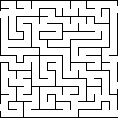

# Maze solver
## Description
In this problem, you are given an image that contains a simple maze. Images can vary in size, but there are some general rules when it comes to how does the maze look like. Each pixel in the maze is either empty, hence free to step on or occupied by wall. pixels that are not empty cannot be visited. Maze can also contain multiple gaps around the border that we call entrances. You can enter the maze in any one of them and exit in any other else. The goal is to find the shortest path one can traverse the maze on. Some definitions are given below.
However, this maze is not just an ordinary maze. It can also contain a certain number of teleports. Those are special pixels that make you able to enter it and exit in any other teleport. You should also find the shortest path using teleports.

  

### Task 1: Count entrances
Count the number of entrances in the given maze.
### Task 2: Shortest path
Find the length of the shortest path in the maze.
### Task 3: Shortest path with a twist
Find the length of the shortest path in the maze if you are allowed to use teleports.
## Input
Input starts with a path to the image that contains maze. This image is must be in PNG format. The next line contains the number of teleports N.
The following N lines contain two numbers – row and column for each teleport in the maze.
## Output
Output contains three lines. The first line represents number of entrances in the maze. The second contains the length of the shortest path while the third contains the length of the shortest path if you are allowed to use teleports. Note that if the shortest path can be obtained without using teleports. In case there is no valid path in the maze, output is -1.
## Definitions
- Pixel is said to be neighboring to another pixel if one can move either left, right, up, or down by exactly one step.
- Path is a list of neighboring pixels.
- The shortest path is a path that visits the least number of pixels.
## My Solution
### Shortest path without using teleports
I've implemented a Breadth-First Search (BFS) algorithm to efficiently find the shortest path. This approach is particularly useful because sometimes a single move doesn't necessarily take us away from the entrance, so I've accounted for this by considering such moves as having zero cost.
To optimize the process and avoid redundant checks for the same entrance, I've integrated this consideration into the BFS algorithm.
### Shortest path with using teleports
In enhancing the search for the shortest path with teleports, I've determined the nearest teleport for each entrance. By aggregating the distances to the two entrances with the closest teleports, I've streamlined pathfinding process.
